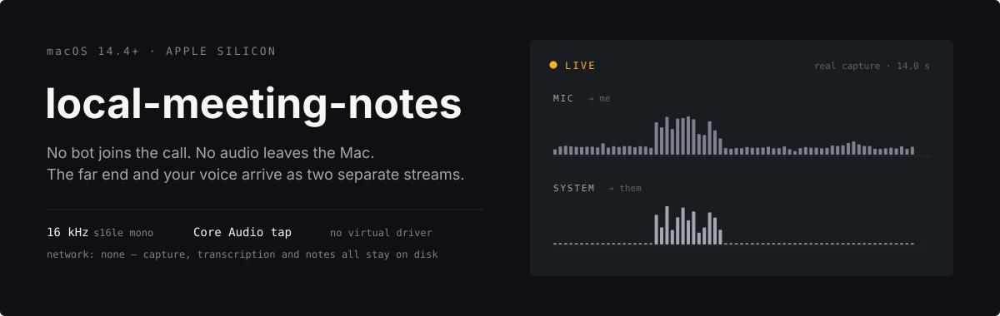
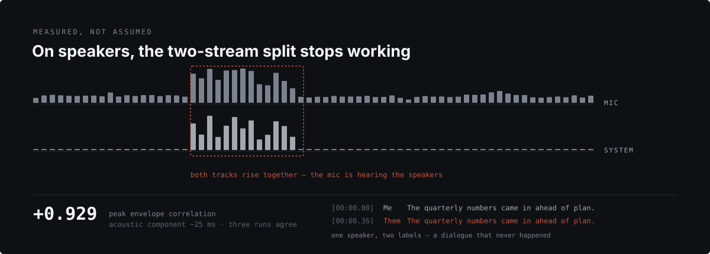
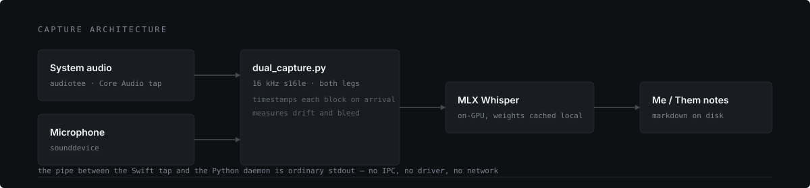

<p align="center">
  
</p>

A meeting notetaker that captures the call from your own machine. No bot joins
the meeting, and the audio never leaves the Mac — system audio comes through a
Core Audio process tap, your microphone comes through the same path
`local-dictation` already uses, and the two arrive as separate streams.

> **Status: product definition, a private real-content encounter awaiting cold
> review, capture and note experiments, but no app.** What exists is a working two-leg capture —
> validated end to end over a 75-minute meeting — a voiceprint gate wired into
> that capture but never yet run on a real meeting, and a local summarizer whose
> evidence graph completes, rechecks and fails closed. Two bounded corpus runs
> under the current list-generating model contract produced rejected diagnostics,
> not an accepted note. By default, a failed run writes no note. Explicitly
> retained research diagnostics carry `passed: false`, and product readers refuse
> their claims. Start with
> [`spike/RESULTS.md`](./spike/RESULTS.md) and [`notes/EVAL.md`](./notes/EVAL.md).
>
> **The ungated, bounded CLI capture path works today** for a call taken on
> headphones with nobody else in the room. It is not an app or a beta. An open
> microphone records the room into the transcript; the voiceprint gate intended to
> fix that is wired in, requires calibrated material from more than one sitting plus
> another voice, and has never been tried on a real conversation. See
> [Limits](#limits).
>
> **The candidate-first extractor is now the bounded feasibility path, not a
> result.** Its candidate list reproduces byte for byte, and the review and
> classifier tools pass tests that never contact the model. No corpus
> classification has run. Its next research gate is operator review of a drafted
> list of decisions, actions, proposals and open questions, plus every section of
> its 582-turn evaluation transcript. The operator must then approve the exact
> validated files. Only then may the registered classifier run. A pass permits
> claim-writing research; it still does not provide a product note. That benchmark
> no longer blocks product interaction work. An eligible private packet now populates
> an owner-only local click-through without putting meeting content or packet metadata
> in Git. It labels populated words as human-curated and automatic extraction as
> untested. The click-through has not passed its cold review. After that interaction
> approval, the safety
> skeleton may be built; an unedited automatic note remains a separate pre-beta
> gate.
> [The capture commands are
> here](#keeping-the-room-out-of-your-half).
>
> **Fresh-history boundary:** this repository begins with one sanitized snapshot
> of the retired `local-meeting-notes` working tree. It contains none of that
> repository's Git history. Historical commit identifiers in the research notes
> are provenance labels from the retired repository, not revisions available
> here. Capture output, transcripts, notes made from private meetings, and review
> packets stay outside Git even while this repository is private. Run
> `python3 privacy_gate.py` before every commit that changes tracked JSON. The
> retired repository's deletion and GitHub-side purge are a separate incident
> record; they do not supply product evidence here.

---

## Product goal and delivery gates

**Goal:** make a local macOS product that quietly captures a meeting, then lets the
operator recover what was decided and promised without trusting an unsupported
summary. Every note claim must lead back to the retained words behind it. Withheld
speech, capture gaps and deleted audio remain visible rather than being rewritten as
certainty.

The first supported beta is deliberately narrow:

- macOS 14.4 or later;
- manual start and stop;
- headphones, with one enrolled operator at the microphone;
- supported meeting capture blocked until that measured profile exists;
- local, post-meeting transcription and note generation;
- a library and note reader with claim-to-transcript evidence;
- correction of withheld turns, note regeneration, a chosen audio auto-deletion
  period and immediate deletion;
- an owner-only voice profile that can be reset without deleting meetings.

Speaker playback, live transcription, calendar preparation, automatic meeting
detection, named participants, cross-meeting search and product-development
inference stay outside that promise. They remain research or later product work.

| Phase | Work an agent can complete | Human gate |
|---|---|---|
| Correctness floor | Close profile, provenance and structured-note contract defects; keep deterministic controls green | None |
| Product encounter | Build a click-through from one consented real capture and operator-confirmed evidence-bound review items, visibly separated from automatic-note evidence; include a rejected-summary state that keeps the transcript and bind the private packet in [`docs/encounter-acceptance.md`](./docs/encounter-acceptance.md) | Operator reviews it cold and approves only the exact interaction |
| Narrow application | Build the Tauri shell, Rust-owned session state, Swift capture sidecar, local worker, private storage and post-meeting processing under the [`post-approval vertical-slice contract`](./docs/vertical-slice.md) | Operator exercises permissions and hardware capture |
| Trust actions | Restore withheld speech, regenerate a note, choose retention, inspect disk use and delete audio or a meeting | Operator chooses the far-end notice and retention policy, then performs each action |
| Limited beta | Package, sign, install cold and run a canary followed by real headphone meetings | Participants consent; the operator judges whether the notes are useful |
| General availability | Prove recovery, updates, fresh-machine permissions and the supported envelope across beta use | Release decision uses beta evidence; passing tests alone cannot make it |

Work may run in parallel only where the evidence remains separable. The registered
classifier benchmark remains research; it does not sit on the product critical path.
Note-contract correctness, profile/provenance hardening and click-through
choreography can proceed independently. After the encounter is approved, the Rust
session supervisor, Swift sidecar packaging, local worker protocol and approved
interface can proceed in isolated worktrees against shared fixtures. Product
implementation does not run ahead of the encounter, and no agent can supply consent,
approve its own design, create a real meeting, judge a note useful or authorize Apple
signing.

---

## What the spike found

<p align="center">
  
</p>

Capturing the microphone and the system separately is supposed to give you
"me versus them" for free. It does — **on headphones, in an empty room**. Both
halves of that condition are load-bearing, and they fail for different reasons.

On speakers it does the opposite. The microphone is a correct recording of the
room, and the room contains the far end, so every sentence lands on both legs.
The transcript then reads as two people agreeing with each other word for word,
and nothing downstream can tell that it never happened. That is worse than
having no speaker labels at all.

So the product treats this as a measurement, not a caveat: correlation between
the two legs is measured over the span where system audio actually played, and
when it is high the transcript stops claiming a split rather than fabricating a
dialogue. The measurement needs the whole capture, so the verdict lands when the
recording stops — a run cannot warn you at the top that it is about to be
contaminated.

**Speaker bleed is not only an attribution defect.** An early synthetic test
fed the summarizer a transcript with labels dropped and every line doubled. That
run retained full topic coverage, but it tested repeated text rather than speech
lost before transcription. On the later real speaker-mode take, the raw
microphone transcript contained none of the operator's passage words and mostly
contained the far end. AEC3 removed nearly all detected far-end words, but only
part of the operator's words returned. No notes-quality evaluation has shown that
artifact to be complete or usable. The current CLI keeps the raw capture and
withdraws the Me/Them split, but it does not persist affected spans or an
incompleteness warning into the note. The product must add that provenance before
beta and does not present speaker mode as supported.

**But an open microphone records the room, and that is a correctness defect —
not a manners one.** On an online call, people talking near you are transcribed,
labelled `Me`, and delivered to the notes as things a participant said. Measured
on the 75-minute capture: **14.2% of merged turns were the room.** No household
subject matter survived compression into the notes, but the notes changed anyway
and deterministically — three action items with the room in, five with it out,
and different open questions. Irrelevant input perturbs *which* real content
survives compression without changing how much does.

Teams and Zoom both solve this by gating the microphone on an enrolled voice
profile, and neither requires an enrollment ritual — the profile is built
passively from ordinary speech. Google Meet does not attempt it and says so
outright: "voices from TV or people talking won't be canceled."

**The supported beta ships deliberate calibration anyway, and that is a deliberate
divergence from the canonical pattern.** It blocks supported meeting capture until
the operator has contributed enough speech across at least two sittings, supplied a
permitted negative sample, and selected an operating point with both measured costs
visible. The reason is the threshold, not the profile: a centroid can be harvested
passively, but the cut point has to be a quantile of the operator's own score
distribution, and nothing passive establishes that before an ungated first meeting
has already decided what to keep. Passive updating is the right later state. It
needs a valid profile to start from and a threshold that survives not knowing whose
speech it just learned from — unbuilt, and not something to fake with a constant.

An off-the-shelf embedding separates the operator from his own household,
measured on five minutes of his speech through the microphone the gate runs on.
His own speech reaches +0.68 to +0.89 with nothing else playing; 197
segments of household speech in the same room on the same microphone reach
+0.577 at the very top. That gap is real but it is not yet a margin — the
strongest household segment lands 0.003 under the operating point, which is a
property of this sample and not a number to ship on. Music across the room costs
about 0.15 and still loses two segments in eight.

That gate is now wired into the capture rather than sitting beside it, so a run
with `--voiceprint` filters the completed microphone transcript before the two
legs are merged. It has still never seen a real conversation.

**AEC3 removes the far end better than it preserves the operator.** On a real
speaker-mode take with a tapped reference, it suppressed echo by 25.3 dB and
reduced detected far-end transcript leakage from 80.5% to 0.0%. Operator-passage
recall rose from 0.0% to 14.7%, against a 77.7% no-far-end reference from another
session. Three later, confounded observations recovered 8.0% to 40.2%, and none
approached that clean reference. The voiceprint score improved from +0.064 to
+0.386, still below the +0.580 threshold, so the gate admitted nothing.

Those are offline results from one room, microphone and voice. The level
observations changed playback content as well as volume, the gate was not
rescored on them, no human has judged notes made from the recovered transcripts,
and AEC3 is not in the live capture path. They establish that cancellation is
worth researching, not a supported speaker-mode envelope. The current record,
including withdrawn claims and the fixed-content sweep still required, is
[`spike/aec3/README.md`](./spike/aec3/README.md). The earlier linear experiments
remain frozen in [`spike/RESULTS.md`](./spike/RESULTS.md) as history rather than
the current product boundary.

**Two defects in the notes half were in the prompt, not the model.** The first
was fabrication: the instructions illustrated a phrasing rule with two example
sentences, and the model reproduced both as decisions a research meeting had
reached — in a transcript where neither subject appears once. Those notes named
nobody, invented no numbers, and were read in full, so every check in place
passed them. Watching numbers is the wrong check on its own; fabricated prose
carries no digits.

The second was the opposite failure. Two rules told the model to leave out
anything it was unsure of and to prefer omitting a section to padding it — rules
written when the open question was whether a local model invents things. It does
not. It omits. Deleting those two rules is **the only change in this project
measured across two models, two domains and five meetings with no regression**;
on the longest transcript tested it took action items from three to eleven. See
[`notes/EVAL.md`](./notes/EVAL.md).

**Clock drift is bounded, not measured.** A 75-minute capture puts relative drift
at +4 ± 63 ppm — inside its own error bars, so there is still no drift *value*,
but the bound is under ~230 ms per hour. That does not close the question the way
it first appears: reordering depends on the gap between adjacent turns across the
two legs, not on turn length, and 7.2% of 416 measured cross-leg transitions sit
closer together than the bound. Drift compensation is not urgent and not provably
unnecessary. Same-device only — a USB or Bluetooth leg is where drift would
actually be expected and is untested.

---

## How it works

<p align="center">
  
</p>

The tap is a small Swift binary ([audiotee](https://github.com/makeusabrew/audiotee),
MIT, vendored — see [`capture/NOTICE`](./capture/NOTICE)) that asks Core Audio
for a process tap and writes PCM to stdout. Asking it for `--sample-rate 16000`
makes it resample inside the tap, so the Python side never has to. The seam
between the two halves is an ordinary pipe: no IPC, no virtual audio driver, no
kernel extension.

Everything downstream — transcription, cleanup, storage — runs on the machine.

---

## Try it

For a new Mac, use the complete [real-meeting handoff](./docs/real-meeting-handoff.md).
The supported capture path requires an Apple Silicon Mac with Metal available,
macOS 14.4+, Xcode Command Line Tools, and Python 3.11+. Python 3.13 is the
measured setup.

```sh
git clone git@github.com:nino-chavez/meeting-notes-local.git
cd meeting-notes-local

(cd capture/audiotee && swift build -c release)     # ~35 s

python3 -m venv .venv
.venv/bin/pip install -r spike/requirements.txt
```

Capture both legs, measure drift and bleed, print a labelled transcript:

```sh
.venv/bin/python spike/dual_capture.py --seconds 60 --out ~/meeting-smoke
```

Every capture requires a new directory. An existing `--out` path is refused so
rerunning a command cannot truncate an earlier meeting. If `--out` is omitted, the
CLI creates an owner-only session directory under
`~/Library/Application Support/local-meeting-notes/captures`. `session.json` is
written atomically and carries the capture-health evidence behind its status.
`complete` means both legs persisted at least one configured 200 ms capture block,
their WAV sample counts match the recorded evidence, neither reported a timeline
gap, both cover the observed capture wall span within measured startup skew and
clock drift, the tap reported no error or unexpected EOF, and a requested
transcript was written with the same health record. `failed` reached finalization
without meeting that integrity floor; `abandoned` was stopped by the operator or
protocol. Anything left `incomplete` never reached finalization and is recovery
material, not a successful meeting.

`--no-transcribe` measures without transcribing, which needs only numpy and
sounddevice and skips the 1.6 GB Whisper download entirely. Plain
`dual_capture.py` runs until Ctrl-C.

That install is not small, and the cost is itemised in
[`spike/requirements.txt`](./spike/requirements.txt) rather than left as a
surprise: the voiceprint gate's two dependencies pull 36 wheels totalling 153 MB,
of which torch alone is 111 MB, and ECAPA's checkpoint adds 89 MB the first time a
profile is built. The deterministic self-tests deliberately need neither — the
encoder is an argument rather than an import, so the controls run on numpy alone.

**The next product input** is smaller: one short, real feedback conversation on
headphones, with every participant knowingly consenting and nobody else in the
room.

```sh
.venv/bin/python spike/dual_capture.py \
  --seconds 180 --out ~/encounter-canary
```

Its only job is to supply real words for the cold interaction review. The
operator then confirms 3–12 review items and their exact transcript fragments.
Those items are labelled human-curated; they do not count as an automatic note,
voiceprint result, or runtime validation. The longer voiceprint enrolment and
gated meeting below remain required for the later automatic-note canary before
beta.

This replaces the 582-turn classifier review as the next product action. That
benchmark remains available for its registered research claim; polishing it
further does not make the app more ready.

### Keeping the room out of your half

An open microphone records the room. On the 75-minute capture, 14.2% of merged
turns were other people talking near the laptop — transcribed cleanly and handed
to the notes as things a participant said. The voiceprint gate removes them, and it
now runs inside the capture rather than beside it.

**You talk normally throughout the operator sittings.** Nothing to read, nothing
playing in the background, no cues on screen.

**1. Two dedicated operator sittings on headphones, at least one hour apart;
different days are ideal.** The supported product cannot bootstrap its first profile
from an ungated meeting and still claim that meeting was inside the supported
envelope. These are calibration captures, not meetings:

```sh
.venv/bin/python spike/dual_capture.py --seconds 180 --out ~/enroll-1
# another day
.venv/bin/python spike/dual_capture.py --seconds 180 --out ~/enroll-2
```

The beta encounter keeps supported meeting capture blocked until these requirements
and the operating-point choice are complete. Later passive updating may use retained
headphone meetings after a valid profile already exists; that path is not built.

**Two things that cannot be shortcut, and both are enforced rather than advised.**

*At least one hour apart; different days are ideal.* Chunking one recording into
"sittings" gives every chunk a different digest while carrying none of the
session-to-session variation the plural is for — same room, same gain, same
position, same voice, same half hour. The threshold would then be measured
leave-one-*sitting*-out across sittings that do not exist, claiming cross-session
evidence it does not have, and reading *better* than the truth. Every capture
records when it happened. Enrolment requires a gap greater than or equal to one hour;
different days are ideal.

*Enough judgeable speech.* A candidate target needs at least
`ceil(1 / target)` held-out segments of two seconds or more before that order
statistic can express the target. Thresholds use the observed `higher` score rather
than an interpolated number. The 117-second take from the echo work has nine, which is
why it is not enough on its own.

**2. Permitted speech that is not you: at least 60 scorable seconds across at
least 20 segments.** Use public-domain or
appropriately licensed playback, or a person who knowingly consents to make this
calibration recording. Do not use a private conversation, an unaware bystander, or
unlicensed program audio.

```sh
.venv/bin/python spike/dual_capture.py --seconds 120 --out ~/not-me
```

Without it the threshold is a rejection rate rather than a gate: it says how much of
*you* it drops and nothing about what it lets through. Enrolment refuses to write a
profile without it. The minute is the registered speech floor. The 20-segment floor is
a product judgement that prevents one long passage from masquerading as a score
distribution and permits a 5% false-admission observation; it is not a statistical
guarantee. Repeating the same recording cannot inflate either floor because its
canonical audio digest is refused.

**3. Report the measured choices without writing a profile.**

```sh
.venv/bin/python spike/speaker_gate.py \
  --calibrate ~/enroll-1/mic-segments.json ~/enroll-1/mic.wav \
  --calibrate ~/enroll-2/mic-segments.json ~/enroll-2/mic.wav \
  --against public-or-licensed \
    ~/not-me/mic-segments.json ~/not-me/mic.wav
```

This first pass is report-only. It offers only targets the held-out operator sample
can resolve and for which the negative sample supplies the other cost. Duplicate
observed cost pairs collapse. If more than three distinct pairs remain, it shows the
loosest, lower-median, and strictest; fewer than two is a refusal, not a one-option
choice.

**4. Choose one displayed row, then rerun explicitly to write the profile.**

```sh
printf 'Paste one choose-with value from the report: '
IFS= read -r CHOSEN_TARGET
test -n "$CHOSEN_TARGET" || exit 2

.venv/bin/python spike/speaker_gate.py \
  --calibrate ~/enroll-1/mic-segments.json ~/enroll-1/mic.wav \
  --calibrate ~/enroll-2/mic-segments.json ~/enroll-2/mic.wav \
  --against public-or-licensed \
    ~/not-me/mic-segments.json ~/not-me/mic.wav \
  --enroll-out ~/voiceprint.json \
  --target-frr "$CHOSEN_TARGET"
```

The CLI refuses a target the report did not display unless the run is explicitly
marked experimental. Use `consenting-person` instead of `public-or-licensed` only
when the source deliberately recorded for this calibration.

The product deletes each dedicated raw recording, transcript, temporary segment list,
and partial working file immediately after the needed owner-only derived material is
safely stored. Extraction or build failure, cancellation, abandonment, and **Discard
enrollment** delete partial dedicated raw and leave enrollment incomplete. A retained
source meeting used for a later rebuild is never copied or deleted by enrollment; its
audio keeps the auto-deletion period already chosen for that meeting. The research CLI
above does not yet implement this lifecycle and leaves its input directories in place,
so it is not the beta privacy behavior.

The product presents three ordered policy choices — preserve more operator speech,
choose the measured middle point, or keep more other voices out. If only two distinct
measured pairs survive, it shows both. No option is selected by default. The measured
operator-speech drop rate and negative-sample admission rate beside each choice come
from that operator's material at runtime; the prototype's populated values are marked
fixtures rather than personal percentages.

`save_profile` does not accept a threshold or operating-point object. It receives the
private held-out operator scores, negative scores and source manifests plus the chosen
target, re-derives the offered table, and persists the selected row. The owner-only
profile carries versioned score-set counts and digests, the deterministic choices and
their digest, the selected row, and the negative recording and segment digests.
`load_profile` repeats that arithmetic and refuses an arbitrary target or edited
threshold. This private receipt is derived enrollment material retained after the
dedicated raw recordings are deleted; it is never exported with a meeting.

The resulting profile is private to the owning macOS account and separate from every
meeting. Resetting it deletes the profile, calibrated threshold, and enrollment
provenance. It does not delete notes, transcripts, meeting audio, retention choices,
or other meetings. The application blocks capture until enrollment completes again.
Only the research CLI may run ungated outside the beta.

**5. Take a meeting with the selected profile on.**

```sh
.venv/bin/python spike/dual_capture.py --seconds 3600 \
  --voiceprint ~/voiceprint.json --out ~/meeting-gated
```

Then hand the transcript to the notes half below and **read the note**. That is the
step, and it cannot be automated: whether a partial transcript supports usable
notes is a judgement about coverage of decisions, names and actions, and about
whether anything in it was invented. Token counts cannot answer it.

**Do a five-minute canary before a real meeting**, and check the three artifacts
reconcile: the gate's printed counts against `transcript.json`'s `voiceprint`
block, and that block against the `capture` line the notes print. Disagreement is
far easier to spot on five minutes than on an hour, and a meeting cannot be
re-taken.

Over-running into an empty room is harmless — bleed is measured only across the
span where system audio was actually playing.

Headphones do two jobs here. They remove the bleed that duplicates every line, and
they give the first clean read on something never yet tested: whether the Me/Them
split survives genuine speech arriving on *both* legs at once. Every capture so far
put all the real words on one leg.

The chosen `--target-frr` is the operating point — the share of your own speech the
threshold may drop. It has no default, because a plausible constant reads exactly like
a measured one to anybody downstream. The report-only pass prints only resolvable
choices and puts each one's measured negative-voice admission cost beside it.

Three things are worth knowing before reading the gate's output as a result:

- **It has never run on a real meeting.** Both halves are measured separately and
  the wiring is under control, but no capture in this project has yet been through
  the gate. What it does to a real conversation is unmeasured. That is the whole
  point of the run above.
- **It stands down when bleed is high**, and says so. Above the correlation cut the
  transcript has already dropped every speaker label, so no attribution is left to
  protect — and that is the same audio where the gate performs worst, admitting 1
  of 7 voiced microphone windows. Those seven are windows of unknown composition,
  so that is an unlabelled outcome rather than a recovery rate, and either reading
  is a reason not to trust the gate there. What the skip costs is the room's words
  staying in the transcript, and [`spike/RESULTS.md`](./spike/RESULTS.md) measured
  that as a real change to the notes: 3 action items and 4 decisions with the room
  in, 5 and 5 with it out, across three byte-identical repeat runs so it is not
  sampling noise. That content cost is accepted rather than risked against deleting
  you.
- **Segments under two seconds are kept, not judged.** The embedding is unreliable
  below that, and short turns are "yes", "agreed", "I'll do that" — the
  commitments the tool exists to record. The run reports how many and how long, so
  the leak is stated rather than hidden.

Every run prints what it dropped, how much of that was a close call, and whether
the dropped speech keeps coming back as one recurring voice. That last one is the
alert Teams ships for the same reason: a gate that removes a real participant
silently is worse than the contamination it replaces, because the transcript then
omits speech with no record that it did.

### The echo experiments

Frozen. These are the commands behind [`spike/RESULTS.md`](./spike/RESULTS.md) and
[`spike/aec3/README.md`](./spike/aec3/README.md), kept so their figures are
reproducible rather than because anything here is waiting on another run. **This is
the part that involves reading passages aloud over background audio** — and it is
not the run that matters now.

A cued capture on *speakers*, which is what the echo work is scored against:

```sh
.venv/bin/python spike/dual_capture.py --list-devices        # pick your mic
.venv/bin/python spike/dual_capture.py --protocol --out ~/take
```

Start the far end playing first, sit where you would take the call, and read each
passage aloud until the cue changes. The cue displays the passage — there is
nothing to memorise, and nothing is ever played audibly, because an audible cue
would land on both legs and pollute the evidence it exists to provide. It writes
`mic.wav`, `system.wav`, `protocol.json` and both legs' segments into the output
directory. `--protocol-pairs` changes the number of speak/silence pairs from the
default five.

Scoring it needs a second, separate take to build an operator profile *inside*
`aec_bound` — distinct from the persisted voiceprint above, which is a different
artifact for a different job. It has to be a different take: the question is
whether the echo work recovers a voice the filter was not fitted on, so scoring the
enrolment audio would be marking its own homework, and `--fit-mode prefix` refuses
the run outright if every take is also an enrolment take.

```sh
.venv/bin/python spike/dual_capture.py --seconds 60 --out ~/enroll

(cd spike/aec3 && make)          # needs webrtc-audio-processing; see its README
spike/aec3/aec3_offline --mic ~/take/mic.wav --ref ~/take/system.wav \
                        --out ~/take/aec3.wav

.venv/bin/python spike/aec_bound.py \
  --take e=~/enroll --take t=~/take --enroll e \
  --segments t=~/take/mic-segments.json --protocol t=~/take/protocol.json \
  --condition aec3=t:~/take/aec3.wav --fit-mode prefix --fit-before 30
```

That reports suppression and voiceprint scores. It does **not** report whether the
words survived, which is the number that actually matters and needs a second tool —
the passages were fixed before the audio existed, so how many of their content
words come back is external ground truth:

```sh
.venv/bin/python spike/retention.py --protocol ~/take/protocol.json \
  --far ~/take/system-segments.json \
  --condition raw=~/take/mic.wav --condition aec3=~/take/aec3.wav \
  --out ~/take/retention.json
```

`--out` refuses any path inside the repository, because those rows carry what was
transcribed and private speech never belongs in source control.

And [`spike/sweep.py`](./spike/sweep.py) runs the whole thing across playback
levels, measuring the ratio from each recording's own silent and speaking intervals
rather than trusting the volume slider. Its three published observations are
confounded — content, spectrum and running order all moved with level — so it grew
`--playback` (one fixed asset, restarted before every take), `--replicates` and
`--shuffle`. Nothing from it should be quoted as a level effect until that has run,
and it is not queued: it belongs on the real-time path once a canceller lives
there, not on this offline harness.

```sh
.venv/bin/python spike/sweep.py --record --playback far-end.wav \
  --levels 25,45,70 --replicates 2 --shuffle 1 --out ~/sweep
```

### Turning a transcript into notes

Needs [Ollama](https://ollama.com) and one local model. Nothing leaves the
machine here either — the transcript is the same secret as the audio.

```sh
ollama pull llama3.1
python3 notes/fetch_corpus.py                          # three real meetings
python3 notes/summarize.py notes/corpus/ES2004c.json
```

Every run prints its own checks: whether the whole transcript was read, whether
any speaker was named that the input never contained, whether any figure or any
content word is absent from the transcript. `--self-test` runs those checks
against notes with known verdicts, in both directions, so a passing check means
something.

With `--out`, a run that fails its hard checks writes no note; the transcript
remains available for retry. `--retain-failed-diagnostic` is an explicit
research-only escape hatch. It records `passed: false`, and product readers
refuse that artifact. Support measurement also refuses failed diagnostics unless
the research-only `--measure-failed-diagnostic` flag is supplied.

`--strip` drops the speaker labels; `--simulate-bleed` drops them *and* doubles
every line, which is what a contaminated capture actually delivers. After a real
capture, point it at the transcript the spike writes:

```sh
python3 notes/summarize.py ~/meeting-smoke/transcript.json
```

That file carries its own attribution level, derived from the capture's measured
bleed — so a contaminated recording arrives as unattributed without anyone
having to remember to say so.

A run also writes `mic-segments.json`: the microphone leg alone, on its own
clock, before the bleed filter runs, carrying the recording's digest and sample
count so it cannot be read against different audio. The transcript is for
reading; that file is for anything that indexes back into `mic.wav`, because the
transcript's times belong to the merged session clock and its microphone turns
have already had the contaminated ones removed.

What neither file carries is who was speaking. "Microphone-only" names the
channel, not the talker — on speakers the far end arrives on the microphone too.
`--protocol` is the answer: it runs a two-minute cued capture and writes
`protocol.json` beside the recordings, a schedule of which intervals the operator
was asked to speak in and which to stay silent through, fixed before any audio
exists. Each speaking cue shows a passage to read aloud for the whole interval, so the
run can verify *per segment* that a given three seconds holds him — echo can make
the microphone loud, but it cannot put his words there. A run whose evidence does
not hold up records itself as inconclusive instead of as a result. The far end's
own transcript is written too, as `system-segments.json`, so a cue passage the
playback happens to say is struck from the evidence rather than credited.

This is a controlled human protocol, not ground truth, and the difference is
worth being exact about because it bounds every number the spike reports. Two
assumptions remain. In the silent intervals, nothing can demonstrate an absence,
so adherence is assumed. In the speaking intervals it is checked — but checked
against the *contaminated* microphone transcript, which is the signal the
experiment exists to improve. Segments that fail that check are
disproportionately the ones echo wrecked, which are the ones cancellation is for.
So a rate computed over only the verified segments is recovery conditional on the
raw transcript having already found him. The harness therefore reports a pair: the
verified subset as the optimistic end, and every segment inside a cued reading
interval as the pessimistic end. Closing that gap needs a near-end observation
channel — a close-talk mic worn by the operator, used only as labels — which this
rig does not have.

### Recording a specific call

Nothing to configure per platform. The tap captures the machine's audio output,
so Zoom, Meet, Teams, or a browser tab are identical to it. Join with capture
off, obtain every participant's consent, then start the capture. Nothing joins
the call and nothing appears in the participant list, which is why that order is
load-bearing.

The corollary: **everything else on the machine lands on the "them" leg** — Slack
pings, a music tab, calendar alerts. Quit the noisy apps and turn on Do Not
Disturb first. The vendored tap can scope to a process (`--include-processes
<pid>`) and the spike deliberately doesn't expose it, because it works for a
native Zoom client but not for Meet, whose audio comes from a Chrome helper whose
PID changes between sessions. A flag that works on one platform and silently
records nothing on another is worse than no flag.

**Set your audio devices before launching.** The microphone is bound when the
stream opens, and the tap follows whatever is the default *output* device — so
connecting headphones mid-capture leaves you recording the built-in mic, or
silence. Both resolved devices are printed before any audio arrives; read that
line rather than assuming. `--input-device` pins the microphone explicitly, by
index or by a substring of its name.

**Permissions.** The terminal needs Microphone and System Audio Recording. The
first run prompts for both; some terminal emulators never prompt, in which case
grant them under System Settings → Privacy & Security. If it runs but records
silence, that is what happened.

---

## What's in here

| Path | What it is |
|---|---|
| [`spike/RESULTS.md`](./spike/RESULTS.md) | What the capture spike proved, and what it structurally could not. |
| [`spike/dual_capture.py`](./spike/dual_capture.py) | The spike: two legs, drift and bleed measurement, three gates, Me/Them transcript. |
| [`spike/speaker_gate.py`](./spike/speaker_gate.py) | The voiceprint: enrolment over several sittings, and the threshold it refuses to invent. |
| [`spike/aec3/`](./spike/aec3/) | WebRTC AEC3 over recorded legs, so a real canceller meets the same table as the offline estimate. |
| [`spike/retention.py`](./spike/retention.py) | Whether the *words* survived — passage recall and far-end leakage, against passages fixed before the audio existed. |
| [`spike/sweep.py`](./spike/sweep.py) | The same across playback levels, with the level measured from the recording rather than the volume slider. |
| [`notes/EVAL.md`](./notes/EVAL.md) | Whether a local model invents things, measured against human-written summaries. |
| [`notes/summarize.py`](./notes/summarize.py) | Transcript to notes, with four fabrication checks and controls for the checks. |
| [`docs/screens-and-states.md`](./docs/screens-and-states.md) | Eleven surfaces, their lifecycle states, and the five templates derived from them. |
| [`docs/journeys.md`](./docs/journeys.md) | What the operator does across days. Six current journeys plus a governed evaluation-contribution candidate, why the unit is retrieval rather than the meeting, a market check including Gong, the registered colleague-survey analysis and two-response snapshot, and the gaps the state inventory could not show. |
| [`docs/vertical-slice.md`](./docs/vertical-slice.md) | The post-approval application boundary: process ownership, worker protocol, private persistence, recovery, workstream split and fault evidence. |
| [`DIRECTION.md`](./DIRECTION.md) | Art direction. Thesis first; the device ledger stays empty until devices ship. |
| [`DESIGN.md`](./DESIGN.md) | Tokens, visual rules, engineering rules, and the Tauri-over-SwiftUI shell decision. |
| [`docs/teardown.md`](./docs/teardown.md) | How Circleback, Fireflies and Granola actually work, and why this is built the way it is. |

The images above are drawn from real captured envelopes and follow this repo's
own `DESIGN.md` palette — including its rule that amber means live capture and
appears nowhere else. The measured values are pinned in
[`assets/readme/envelopes.json`](./assets/readme/envelopes.json) rather than
re-measured on every run, so regenerating one diagram cannot silently redraw the
others from whatever capture happens to be in `spike/out` — which is how the
14-second caption would have come to describe a different recording.

---

## Limits

- **An open microphone records the room, and the fix has never been tried on a
  real meeting.** Speech from people near you is transcribed and labelled as
  yours. Headphones do not help — they cut the far end out of your microphone,
  which is a different defect. The voiceprint gate that fixes this is now wired
  into the capture (`--voiceprint`), but it is measured only on this project's own
  recordings of one voice and a household; what it does to an actual conversation
  is unknown. Until that run happens, treat it as untested and be the only person
  in the room.
- **The gate needs enrolment evidence the repository cannot bundle.** Its threshold
  is a quantile of your own score distribution, so the calibration command derives
  it from recordings made over two or more sittings; there is deliberately no
  fallback constant. A single sitting produces a measurably over-tight threshold
  that drops more of you than you asked.
- **Speaker mode is research, not a supported degraded mode.** The far end
  returning through the room corrupts both the transcript and the operator's
  voiceprint. Offline AEC3 removes most detected far-end words, but operator-word
  recall remains partial, the gate admitted nothing on the real take, no human
  notes-quality evaluation exists, and the canceller is not in the live capture
  path. The product must retain the capture and state that coverage is unknown;
  it must not render the result as a complete unlabelled note. Preventing the
  acoustic path with headphones is necessary for the bounded CLI envelope, not
  sufficient for beta support: the operator must also be alone in the room until
  the enrolled gate passes a real-meeting evaluation. See
  [`spike/aec3/README.md`](./spike/aec3/README.md).
- **macOS only.** Core Audio process taps are 14.4+. The Windows equivalent is
  WASAPI loopback and is not implemented.
- **Speaker labels stop at "me" and "them."** Named participants come from a bot
  in the call or from scraping the meeting UI, never from the audio alone. See
  [`docs/teardown.md`](./docs/teardown.md) for how the commercial products get
  them.
- **Recall trails a hosted notetaker.** On two real calls hand-scored against a
  published rule, these notes caught 8 of 10 commitments that Gemini caught 10 of.
  Every recall figure here rests on ten commitments across two meetings — the
  thinnest evidence in the project.
- **Muting is not a privacy control.** The tap reads the rendered stream before
  hardware volume, so a muted or zeroed output is still captured in full. Stop
  the capture; do not rely on the volume knob.
- **Recording law and participant expectations vary by jurisdiction and context.**
  Obtain the consent your meeting requires before capture. The product can make that
  choice explicit; it cannot make the legal decision for you.

## License

MIT — see [`LICENSE`](./LICENSE). The vendored tap is separately MIT, Copyright
© 2025 Nick Payne; see [`capture/NOTICE`](./capture/NOTICE).
