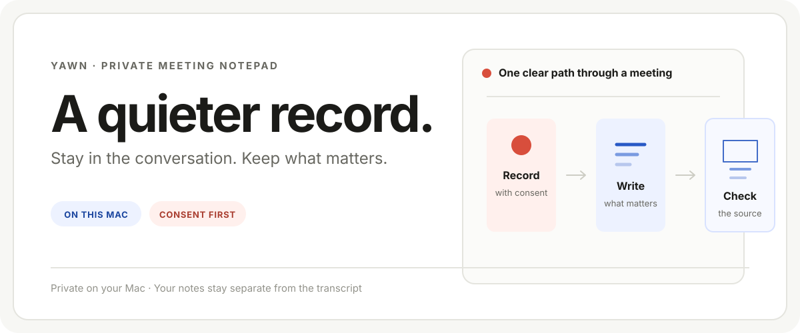

<h1 align="center">Yawn</h1>

<p align="center">
  A private meeting notepad for macOS.<br />
  <sub>On this Mac · No account · No upload · No meeting bot</sub>
</p>

<p align="center">
  
</p>

> [!IMPORTANT]
> **Internal alpha.** Yawn currently supports Apple-silicon Macs running macOS
> 14.4 or later. The first setup downloads the local speech runtime and models
> (about 2 GB). No meeting data is uploaded.

Yawn keeps one job simple: stay in the conversation while you keep a useful,
private record of it. Record a consented meeting, write the details you do not
want to lose, then reopen the finished note when you need to check it.

## A meeting has three moments

| Before | During | After |
| --- | --- | --- |
| Confirm consent, headphones, and audio retention. | Keep your own notes in a calm canvas while Yawn records. | Reopen the note, generated draft, and source transcript from Meetings. |

Yawn is deliberately not a workspace, dashboard, task manager, CRM, calendar,
or shared meeting bot. Read [the product brief](./docs/product-brief.md) for
the complete product contract.

## Private by design

- Capture, transcription, and retained meeting data stay on this Mac.
- Recording begins only after you confirm participant consent, headphones, and
  that you are the one person near the microphone.
- You explicitly choose whether retained recording audio lasts **1, 7, or 30
  days**.
- Your notes, generated meeting-note claims, and source transcript remain
  distinct. The transcript is there when you need to check a detail.
- An interrupted or failed run is shown plainly. It is never presented as a
  completed meeting.

## Run Yawn locally

```sh
git clone git@github.com:nino-chavez/yawn-app.git
cd yawn-app
./worker/build_runtime.sh build-alpha
cd apps/desktop
npm ci
npm run dev
```

The local runtime is intentionally ignored by Git. Do not commit it, symlink
it, or store meeting exports in this checkout.

### Before your first recording

1. Grant the requested macOS permissions.
2. Get clear participant consent to record.
3. Use headphones and make sure you are the only person near the microphone.
4. Choose the audio-retention period that fits the meeting.

A successful build proves the software built. It does not prove that a real
meeting was recorded, transcribed, or useful.

## Work on the app

Run the focused checks before changing the desktop surface:

```sh
(cd apps/desktop && npm run test:ui)
cargo test -p local-meeting-notes-desktop
```

| When you need to… | Start here |
| --- | --- |
| Change the macOS app or its interface | [apps/desktop](./apps/desktop/) |
| Change capture, storage, or meeting contracts | [crates/session-core](./crates/session-core/) |
| Change local transcription or note processing | [worker](./worker/) |
| Understand packaging and releases | [distribution runbook](./docs/distribution-runbook.md) |

## Evidence and deeper reading

- [Product brief](./docs/product-brief.md) — the current product contract and
  scope.
- [Real-meeting handoff](./docs/real-meeting-handoff.md) — a bounded manual
  test for an actual meeting.
- [Audio and voice-isolation results](./spike/RESULTS.md) — measured limits and
  evidence.
- [Note-generation evaluation](./notes/EVAL.md) — measurement evidence for
  generated notes.

## License

MIT — see [LICENSE](./LICENSE).
